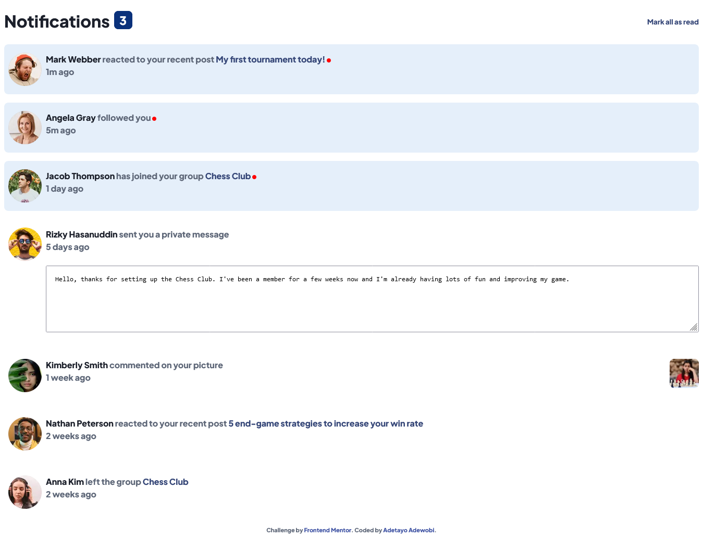

# Frontend Mentor - Notifications page solution

This is a solution to the [Notifications page challenge on Frontend Mentor](https://www.frontendmentor.io/challenges/notifications-page-DqK5QAmKbC). Frontend Mentor challenges help you improve your coding skills by building realistic projects. 

## Table of contents

- [Overview](#overview)
  - [The challenge](#the-challenge)
  - [Screenshot](#screenshot)
  - [Links](#links)
- [My process](#my-process)
  - [Built with](#built-with)
  - [What I learned](#what-i-learned)
  - [Continued development](#continued-development)
  - [Useful resources](#useful-resources)
- [Author](#author)
- [Acknowledgments](#acknowledgments)

**Note: Delete this note and update the table of contents based on what sections you keep.**

## Overview

### The challenge

Users should be able to:

- Distinguish between "unread" and "read" notifications
- Select "Mark all as read" to toggle the visual state of the unread notifications and set the number of unread messages to zero
- View the optimal layout for the interface depending on their device's screen size
- See hover and focus states for all interactive elements on the page

### Screenshot




### Links

- Solution URL: [Add solution URL here](https://github.com/LivingHopeDev/notifications-page-main)
- Live Site URL: [Add live site URL here](https://livinghopedev.github.io/notifications-page-main/)

## My process

### Built with

- Semantic HTML5 markup
- CSS custom properties
- Flexbox
- Mobile-first workflow


### What I learned

I was able to reuse some of my css code for multiple tasks. Using the mobile-first approach really saved me alot of stress and I only made use of few media query to allow the textarea layout look better on large screen size


```html
<div class="card flex-container">
      
      <p><span><strong><a href="#">Angela Gray</a></strong></span> followed you <span class="dot"></span><br>
        5m ago
      </p>
    </div>
```
```css
.num {
    display: inline-block;
    margin-top: .8rem;
    margin-left: .5rem;
    border: 1px solid hsl(219, 85%, 26%);
    border-radius: 8px;
    outline: none;
    background-color: hsl(219, 85%, 26%);
    color: hsl(0, 0%, 100%);
    padding: 0 .6rem;
    font-size: 1.4rem;
}
```


### Continued development
- I would love to practice more of responsiveness in my future projects. 
- Building complete web pages.


### Useful resources

- [Example resource ](https://www.w3schools.com/js/js_htmldom_css.asp) - This helped me to recall how DOM works. 


## Author

- Frontend Mentor - [@yourusername](https://www.frontendmentor.io/profile/livinghopedev)
- Twitter - [@yourusername](https://www.twitter.com/adewobiadetayo)


